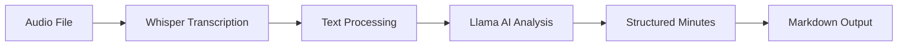

# 🎯 AI Meeting Minutes Generator

Transform any meeting audio into professional meeting minutes using AI - completely FREE!

## 🚀 Features

- **Audio Transcription**: Convert meeting audio to text using OpenAI Whisper or open-source alternatives
- **AI-Powered Analysis**: Generate structured meeting minutes using Meta Llama 3.1
- **Professional Formatting**: Clean markdown output with summaries, action items, and attendee lists
- **Cost Effective**: Free tier available with Google Colab
- **Multiple Models**: Support for both OpenAI and open-source models
- **Batch Processing**: Handle multiple audio files efficiently

## 📋 What You Get

The AI automatically generates:

- ✅ **Executive Summary** with meeting overview
- ✅ **Attendee List** with participants
- ✅ **Key Discussion Points** organized by topic
- ✅ **Action Items** with assigned owners
- ✅ **Next Steps** and follow-up tasks
- ✅ **Clean Markdown** format ready for sharing

## 🛠️ Quick Start

### Option 1: Google Colab (Recommended)

1. Click the "Open in Colab" button above
2. Run all cells in sequence
3. Upload your audio file
4. Get professional meeting minutes!

### Option 2: Local Setup

```bash
# Clone the repository
git clone https://github.com/yourusername/meeting-minutes-ai.git
cd meeting-minutes-ai

# Install dependencies
pip install torch transformers accelerate openai bitsandbytes

# Set up environment variables
export OPENAI_API_KEY="your_api_key_here"
export HF_TOKEN="your_huggingface_token"

# Run the notebook
jupyter notebook Meeting_Minutes_product.ipynb
```

## 🔧 Configuration

### Required API Keys

1. **OpenAI API Key** (for Whisper transcription)

   - Sign up at [OpenAI](https://openai.com/api/)
   - Generate API key
   - Cost: ~$0.006/minute of audio

2. **HuggingFace Token** (for Llama model access)
   - Create account at [HuggingFace](https://huggingface.co/)
   - Generate access token (free)

### Supported Audio Formats

- MP3, WAV, M4A, FLAC
- Maximum file size: 25MB for OpenAI Whisper
- Recommended: Clear audio with minimal background noise

## 💰 Cost Breakdown

| Component                    | Cost          | Notes                          |
| ---------------------------- | ------------- | ------------------------------ |
| OpenAI Whisper               | $0.006/minute | Pay-per-use                    |
| Meta Llama 3.1               | FREE          | Via HuggingFace                |
| Google Colab                 | FREE          | With usage limits              |
| **Total for 1-hour meeting** | **~$0.36**    | **vs $50+ for manual service** |

## 🎯 Use Cases

### Corporate

- Board meetings
- Project reviews
- Client calls
- Team standups
- Training sessions

### Educational

- Lecture recordings
- Student discussions
- Research interviews
- Academic meetings

### Personal

- Community meetings
- Event planning
- Family discussions
- Podcast transcription

## 📊 Model Options

### Audio Transcription

1. **OpenAI Whisper** (Recommended)

   - High accuracy
   - Multiple languages
   - Handles accents well
   - Pay-per-use

2. **Qwen2-Audio** (Free Alternative)
   - Open source
   - Local processing
   - No API costs
   - Requires more GPU memory

### Text Generation

1. **Meta Llama 3.1-8B** (Default)
   - Free via HuggingFace
   - High quality output
   - 4-bit quantization support

## 🔄 Workflow



## 📝 Example Output

```markdown
# Meeting Minutes: Denver City Council

## Summary

- **Date:** October 9th, 2017
- **Location:** Denver City Council Chambers
- **Attendees:** 11 council members present
- **Purpose:** Indigenous Peoples Day Proclamation

## Key Discussion Points

- Proclamation No. 1127 for Indigenous Peoples Day
- Recognition of Indigenous contributions to Denver
- Cultural celebration vs. historical acknowledgment

## Action Items

1. **Adopt Proclamation** - Council (Motion passed)
2. **Distribute copies** - City Clerk
3. **Community outreach** - Indigenous Commission
```

## 📈 Performance Tips

1. **Audio Quality**: Use clear recordings with minimal background noise
2. **GPU Usage**: Enable GPU in Colab for faster processing
3. **Batch Processing**: Process multiple files together for efficiency
4. **Model Selection**: Choose models based on your accuracy vs. cost requirements

## 🙏 Acknowledgments

- [OpenAI](https://openai.com/) for the Whisper model
- [Meta](https://ai.meta.com/) for Llama models
- [HuggingFace](https://huggingface.co/) for model hosting
- [Google Colab](https://colab.research.google.com/) for free GPU access

---

⭐ **If this project helped you, please give it a star!** ⭐
